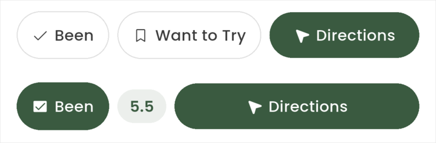
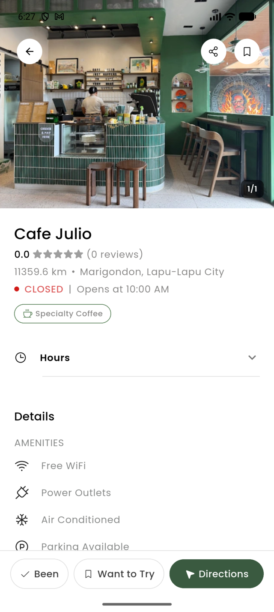
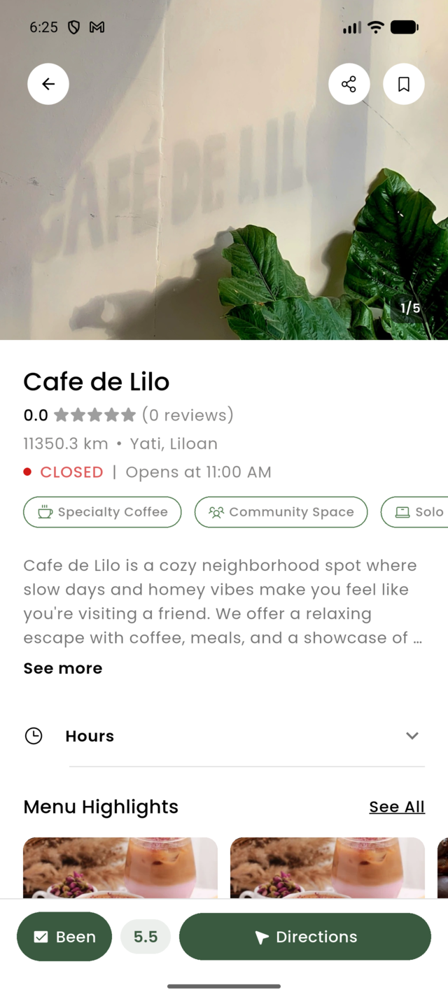
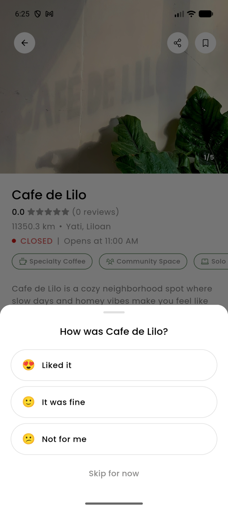
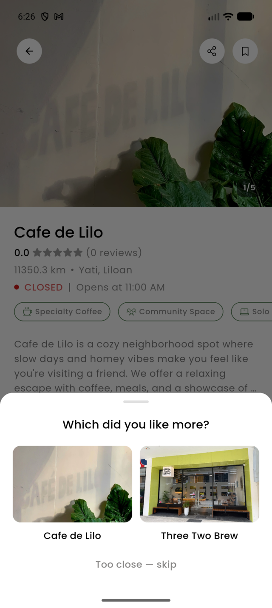

# Been / Want to Try Design Prompt — cafe details

A self-contained brief for redesigning the **Been / Want to Try feature as it appears on the
cafe details screen**: the status pills, the ranking flow they trigger, the note, and the
relationship between all of that and the separate bookmark that already lives on the same
screen. Paste the block below into a design tool (Claude, v0, Figma Make, Lovable) or hand it
to a designer.

This is the third brief in the set and the one that covers the *entry point* — the moment a
user marks a cafe. `lists_ranking_design_prompt.md` covers where those marks end up.
`homepage_design_prompt.md` covers discovery.

**Retargeting:** the brief asks for static HTML/CSS mocks at 390×844. Change only the
**Deliverables** section for other targets (see `homepage_design_prompt.md` for the wording).

**Screenshots are attached** — see [Reference](#reference--attach-these). Real captures from a
live account.

---

## The prompt

> You are redesigning one feature of **Nook**, a mobile app for discovering independent coffee
> shops in the Philippines. Native app (Flutter), iOS + Android, phone only.
>
> The feature is **Been / Want to Try** — how a user marks a cafe they've visited or wants to
> visit — as it appears on the **cafe details screen**. You are designing the whole interaction,
> not one control: the marking, what happens immediately after, and how the screen represents a
> cafe the user has a history with.
>
> ---
>
> ## How the feature works today (read this carefully — it's the whole context)
>
> ### The two marks
>
> Every cafe has exactly one status for the current user, and it is one of three values:
>
> ```
> none          the default
> want_to_try   a backlog item — "I should go here"
> been          a visited cafe — "I've been"
> ```
>
> They are mutually exclusive. Setting one clears the other. Behind the scenes each is a
> **system list** — every user automatically has a "Been" list and a "Want to Try" list that
> can't be renamed or deleted — but the user is never shown that plumbing on this screen. They
> just see two pills.
>
> Marking is **one tap, optimistic, and instant**. It fires a haptic. Nothing blocks it, and
> nothing may ever be added that blocks it — this is the single most important product rule in
> the feature. Tapping an already-selected pill unsets it back to `none`.
>
> ### What happens after "Been" — the ranking flow
>
> Nook is not a review site. Every user keeps a **private diary of the cafes they've been to,
> ordered best to worst.** The instant a Been is saved, a bottom sheet chain opens:
>
> ```
> Step 1 — the feeling            "How was Cafe de Lilo?"
>                                 ( 😍 Liked it ) ( 🙂 It was fine ) ( 😕 Not for me )
>                                 "Skip for now"
>
> Step 2 — head-to-head           "Which did you like more?"     × up to 4, usually 2–3
>                                 [ this cafe ]  vs  [ one you already ranked ]
>                                 "Too close — skip"
>
> Step 3 — the reveal             Cafe de Lilo
>                                 8.4                    ← 56px, brand green
>                                 #3 of 12 · My Cebu Cafes
>                                 ( Done )  ( Add a note )
> ```
>
> Mechanically: the feeling picks a **band** (liked / fine / disliked); the comparisons
> binary-search the cafe's position *within* that band; the server derives a 0–10 score from
> band + position. Every step is skippable and the Been mark is **already saved** before the
> sheet opens — skipping falls back to a plain "Added to Been · Add a note" toast. Ranking is
> the dessert, not the bill.
>
> The score reveal fires a medium haptic. It is meant to be the emotional peak of the app.
>
> ### The other things on this screen
>
> - **A private note.** One free-text field per Been cafe. Reachable by long-pressing the Been
>   pill, or from "Add a note" on the reveal / toast.
> - **A score chip.** Once ranked, an `8.4` pill sits in the bottom bar. Tapping it reopens the
>   ranking flow from step 1 — **this is the only way to change a rank.** Drag-to-reorder does
>   not exist and is deliberately not planned.
> - **A bookmark, in the top-right of the photo.** Completely separate system: it saves the
>   cafe to a user-created list ("Weekend spots"), with a quick-save default and a "Save to
>   list" sheet. It predates Been / Want to Try and was never reconciled with it.
> - **A public rating**, `0.0 ★★★★★ (0 reviews)`, under the cafe name. Community-wide, not the
>   user's. Almost always 0.0 right now.
>
> ### Copy rules — product law, do not break them
>
> - **Never the word "rating"** for the user's own score. It's *your* list, *your* score.
> - **A score is never shown alone** — always with rank context, `8.4 · #3 of 12`. The number
>   alone reads as a review; the pair reads as a diary.
> - **Bucket labels stay feelings** — "Liked it", not "Good", not a grade.
>
> ---
>
> ## Non-negotiable design tokens
>
> Use these exactly. Do not introduce new colors, sizes, or radii.
>
> **Color**
> ```
> #344E41  brand green   — active states, primary actions, emphasis
> #3A5A40  green 80      — selected pill fill; the score color
> #588157  green 60      — chip borders, decorative  (NON-TEXT ONLY)
> #A3B18A  sage 40       — decorative
> #DAD7CD  sage 20       — backgrounds, dividers
> #0A0F0D  black         — primary text
> #767574  gray          — secondary text
> #FEFEFE  white         — surfaces
> #E0E0E0  border        — the hairline; 1px; the ONLY way depth is drawn
> ```
>
> **Type — Poppins. Four sizes, two weights.**
> ```
> 24 / 500   page titles          18 / 500   sheet titles
> 15 / 500   pill + row labels    15 / 400   body
> 12 / 500   captions, chips      12 / 400   fine print
> ```
> One exception: **the revealed score may be large** (up to 56/500, `#3A5A40`).
>
> **Space — 4pt grid:** `4 · 8 · 12 · 16 · 24 · 32`. Gutter 22. Section gap 36.
>
> **Radius:** `12` cards and images · `999` pills · `20` bottom sheets.
>
> **Elevation:** `0`. Always. **No shadows exist in this app.** Depth is a 1px `#E0E0E0` border.
>
> ### Hard constraints
>
> - **Light mode only.** Phone widths 360–430pt; design at **390×844**.
> - **Marking must stay one tap.** Any design that puts a decision in front of the mark is
>   rejected on sight.
> - **The bottom action bar is sticky** and shares its row with **Directions**, which is the
>   app's conversion event and must stay reachable at any scroll depth.
> - **Text must survive 200% scaling.** No fixed-height container may contain text. The action
>   bar is the worst offender — show it reflowed.
> - **Tap targets ≥ 48×48.** No nested tap targets.
> - **`#767574` on white is the floor for secondary text.** Never put text on `#588157`.
> - **Signed-out users** see the pills but any tap sends them to login. Design that.
>
> ---
>
> ## The problems to solve — this is the brief
>
> **1. The action bar silently drops a control when a cafe is ranked.**
> Unranked, the bar is `[Been] [Want to Try] [Directions]`. Once ranked, it becomes
> `[Been] [8.4] [Directions]` — **Want to Try disappears entirely**, because four controls
> don't fit in one row. The stated reasoning is that a backlog toggle is noise post-visit, but
> the effect is that a control vanishes with no explanation and the only way to get it back is
> to un-Been the cafe first. See the attached side-by-side. Solve the row, don't paper over it.
>
> **2. There are two unrelated save systems on one screen.**
> A bookmark icon floats over the photo (top-right) and saves to user-created lists. Been /
> Want to Try sit in the bottom bar. They look nothing alike, they're at opposite ends of the
> screen, and nothing tells the user why "Want to Try" isn't just another bookmark. A first-time
> user has to guess which one means "save this." **This is the highest-leverage problem in the
> brief.** Reconcile them — merge, subordinate, or clearly differentiate — and defend the call.
>
> **3. Two scoring systems sit inches apart and neither is explained.**
> The header shows `0.0 ★★★★★ (0 reviews)` — the community rating, almost always 0.0 because
> the catalog is new. The bottom bar shows `5.5` — the user's own private score. Same screen,
> same visual weight class, completely different meanings, no labels. And the public one is
> usually a row of empty gray stars, which makes the cafe look bad for no reason.
>
> **4. The score chip breaks the copy rule.**
> It renders a bare `5.5`. The rule requires rank context — `5.5 · #6 of 6`. As shipped it
> reads as a rating of the cafe rather than a position in a diary, which is exactly the framing
> the product is trying to avoid.
>
> **5. Re-ranking is invisible, and once found, it's disorienting.**
> Tapping the score chip is the *only* way to re-rank, and nothing signals that. When it does
> open, it's step 1 again — "How was Cafe de Lilo?" — with no indication that the cafe is
> already ranked, what it's ranked now, or that "Skip for now" will leave the old rank intact
> rather than clear it. Re-ranking and first-ranking are the same screen for two different jobs.
>
> **6. The comparison step gives the user nothing to hold onto.**
> "Which did you like more?" with two photos, up to four times. No progress ("2 of 3"), no back
> step, no way to undo a misfire, and no reminder of *why* they're being asked. It's the longest
> part of the flow and the least explained — the most likely place to bail.
>
> **7. Nothing on the screen shows a Been cafe's own history.**
> The user has visited this place and written a note about it. The details screen shows a filled
> pill and a number. The note — the actual diary content — is behind a **long-press on the Been
> pill**, an interaction with zero discoverability. Their own history with the cafe should
> probably be *on* the page.
>
> **8. Removing a mark is silent and unrecoverable.**
> Tapping a selected pill unsets it immediately. Un-Beening also **deletes the ranking**
> server-side. The user gets a plain "Removed from Been" toast with no undo, and there is no
> warning that a score they built through four comparisons just evaporated. (The spec called for
> an undo toast; it was never built.)
>
> **9. The feature is invisible everywhere else in the app.**
> The status control exists on this one screen. Cafe cards on home, search, and map show no
> Been / Want to Try badge at all, so a user browsing can't see they've already been somewhere.
> A badge was specified and never built. Propose the badge as part of this brief — it is the
> thing that makes the feature feel present rather than buried.
>
> ---
>
> ## Deliverables
>
> 1. **Static HTML/CSS mocks at 390×844**, self-contained in one file, no external resources.
>    Placeholder images may be solid `#DAD7CD` blocks with a centered coffee glyph.
> 2. **The cafe details screen in four states:** unmarked · Want to Try · Been unranked ·
>    Been ranked (with note). Show the full screen, not just the bar — problems 2, 3 and 7 are
>    about how the whole page composes.
> 3. **The action bar called out at 2x** in all four states, annotated, plus a reflow at 200%
>    text scale. This is where problem 1 gets solved or doesn't.
> 4. **The ranking flow, all three steps**, including the re-rank variant of step 1 and a
>    progress treatment for step 2.
> 5. **The card badge** (problem 9) on a standard cafe card, both variants.
> 6. **A short rationale** — 8 bullets max. Must answer: what happened to the bookmark, how the
>    bar fits four controls (or why it shouldn't), how a user now discovers re-ranking, and what
>    you did about the empty public rating. Say what you deliberately did *not* do.
>
> ## Rules
>
> - Work inside the tokens. If a token is wrong, say so in the rationale — don't silently invent.
> - No shadows. No gradients except over a photo for legibility. No new fonts.
> - **Don't add data the backend doesn't have.** No visit dates, no visit counts, no per-category
>   scores, no friend activity, no public profiles. All are real roadmap items; none are built.
> - **Drag-to-reorder is out of scope** by design — the comparison flow is the re-rank tool.
> - **Marking stays one tap.** Repeated because it is the rule most likely to be broken by a
>   design that wants to be helpful.
> - This replaces a working, shipped feature. Every change must be defensible as *better*.
>
> ## Reference — attach these
>
> Real captures from a live account, Android, 1280×2856 (390pt logical width).
>
> **1. `images/been_want_to_try/actionbar-both-states.png`** — the two action bar states stacked.
> Top: unmarked, three controls. Bottom: ranked, and Want to Try is gone. **Problem 1 in one
> image** — lead with this.
>
> **2. `images/been_want_to_try/details-unmarked.png`** — full screen, no status set. Note the
> bookmark icon top-right over the photo (problem 2) and the `0.0 ★★★★★ (0 reviews)` block
> under the name (problem 3).
>
> **3. `images/been_want_to_try/details-ranked.png`** — the same screen for a Been + ranked cafe:
> filled Been pill, bare `5.5` chip, no Want to Try, bookmark still floating top-right, public
> `0.0` rating still directly above the user's own score.
>
> **4. `images/been_want_to_try/rank-step1-bucket.png`** — the feeling step. This capture is a
> **re-rank** of a cafe already scored 5.5, which is exactly problem 5: nothing on the sheet
> says so.
>
> **5. `images/been_want_to_try/rank-step2-compare.png`** — the head-to-head. Note the absent
> progress indicator and absent back affordance (problem 6).
>
> **Not captured:** the score reveal (step 3), the note sheet, and the "Added to Been" toast —
> reaching them would have written to a real user's diary. Design them from the description above.
>
> **Ignore in all captures:** the `11350.3 km` distance. The emulator reports a non-Philippine
> location; on a real device this reads `1.2 km`.

---

## The screenshots

Captured 2026-07-26 from the Android emulator against the live Supabase project, account
`lucerocris22@gmail.com`. Downscaled to 640px wide (720 for the bar composite).

**Problem 1 — the vanishing control:**



| Unmarked | Been + ranked | Step 1 — feeling | Step 2 — compare |
|---|---|---|---|
|  |  |  |  |

**How these were captured, and what was avoided.** The ranking sheet was opened from the score
chip and dismissed with a back press before any bucket was chosen, then again after choosing a
bucket but before answering a comparison — neither path writes. Opening the sheet writes nothing;
`_CafeRankingFlowState.dispose` calls `cancelSession`. The score was verified as still `5.5`
afterwards. **Step 3 cannot be captured without permanently altering a real user's rankings**,
which is why it is missing. Use a throwaway account if you want it.

```bash
adb exec-out screencap -p > shot.png
magick shot.png -resize 640x docs/images/been_want_to_try/<name>.png
```

---

## Notes for whoever runs this

**Problem 2 is the one to actually decide before designing.** The bookmark
(`_SavedButton` in `cafe_details_page.dart:481`) and the status pills are independent code paths
writing to different tables, built at different times. No amount of visual polish fixes the
conceptual overlap — someone has to decide whether custom lists remain a peer of Want to Try or
become subordinate to it. Design can propose; product has to sign off.

**Problems 4, 8 and 9 are shipped deviations from the written spec, not new ideas:**
- §3.3 of `RANKING_DESIGN.md` requires score-with-rank-context. The chip ships bare.
- §3.1 of `BEEN_WANT_TO_TRY.md` specifies an undo toast on unset. `showPrimaryToastWithAction`
  exists and is already used for "Add a note" — the undo variant was simply never wired up.
- §3.2 specifies a card status badge. `CafeStatusCubit` is read by exactly one widget
  (`cafe_actions_bar.dart`); no card surface consumes it. `CafeStatusControl` lives in `core/`
  precisely because the spec expected it on cards and the map, and it appears on neither.

These four are worth fixing regardless of whether the redesign lands.

**Problem 1 has a cheap escape hatch worth evaluating before a redesign:** the score chip and
the Been pill are arguably the same object. A filled Been pill that *contains* the score
(`✓ Been · 8.4`) frees a slot and keeps Want to Try visible. If the designer proposes something
more ambitious, fine — but that fallback should be in the rationale as the thing they beat.

**Constraint most likely to be violated:** "marking stays one tap." A designer looking at this
feature will naturally want to ask the user something at mark time — which list, which visit
date, how it was. The entire flow is architected so the write lands *first* and every question
is skippable afterwards. A mock that adds a required step before the mark has misunderstood the
product, however good it looks.

**Related briefs:** `lists_ranking_design_prompt.md` (where these marks are read back —
the Lists index and the ranked Been list) and `homepage_design_prompt.md` (discovery).
Problem 9's card badge is shared surface area with both; whoever designs it should look at all
three.
