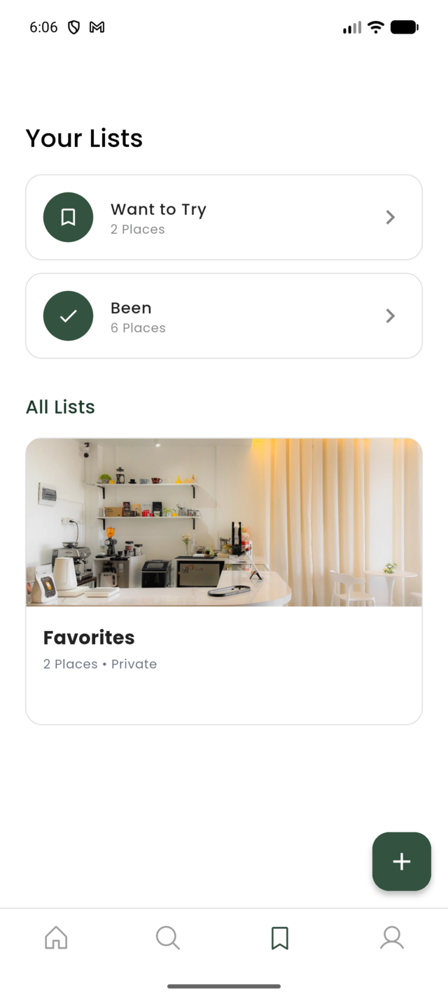
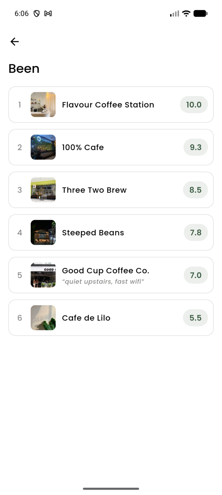
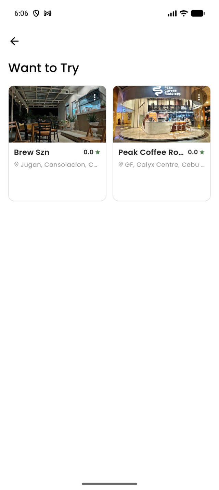

# Lists & Been Ranking Design Prompt

A self-contained brief for redesigning two adjacent screens: the **Lists index** (`ListsPage`)
and the **Been ranked list** (`ListDetailPage` when `listType == 'been'`, body rendered by
`RankedBeenList`). Paste the block below into a design tool (Claude, v0, Figma Make, Lovable)
or hand it to a designer — it carries its own context and doesn't require reading the codebase.

They are briefed together on purpose: the Been card on screen 1 is the entry point to screen 2,
and today they are designed as if by two different people.

**Companion brief:** `been_want_to_try_design_prompt.md` covers the other end of the same
feature — how a cafe *gets* onto these lists, on the cafe details screen. Read both before
designing either; the score chip and the card badge are shared surface area.

**Retargeting:** the brief asks for static HTML/CSS mocks at 390×844. Change only the
**Deliverables** section for other targets:
- *Flutter code* → "Deliver a Flutter widget tree using the tokens above. Assume
  `context.textTheme` extensions exist and use `AdaptiveTap`, not `InkWell`."
- *Figma / image* → "Deliver high-fidelity mocks at 390×844, 2x."
- *Human designer* → drop Deliverables; keep everything else.

**Screenshots are attached** — see [Reference](#reference-attach-these) at the foot of the prompt.
They are real captures from a live account, not mockups. Two states could not be captured without
destroying real user data; see the note there.

---

## The prompt

> You are designing two screens of **Nook**, a mobile app for discovering independent coffee
> shops in the Philippines. Native app (Flutter), iOS + Android, phone only.
>
> ### The product idea you need to understand first
>
> Nook is not a review site. Every user keeps a **private diary of cafes they've been to**,
> ordered best-to-worst — their own ranking, not a public rating. After marking a cafe as
> "Been," the app asks one feeling question (Liked it / It was fine / Not for me) and then
> 2–4 head-to-head comparisons ("Which did you like more?"), then reveals a score: **8.4 ·
> #3 of 12**. That reveal is the emotional payoff of the whole app.
>
> **The two screens you're designing are where that diary lives.** Right now they don't feel
> like a payoff — they feel like file management.
>
> ### Who it's for
>
> Young, urban, design-literate Filipinos; mid-range Android as often as iPhone. They come to
> these screens for two different reasons, and today's design serves neither well:
> - **"Where should I go?"** — pull up saved places, decide fast.
> - **"What have I been to?"** — browse their own history for pleasure, the way you'd reread
>   your own Letterboxd. This is the retention loop.
>
> ### The brand in one line
>
> Quiet, warm, and photographic. Hunter green and off-white, generous whitespace, flat surfaces
> with hairline borders — closer to a good print magazine than a food-delivery app. The
> photography carries the emotion; the chrome stays out of the way.
>
> ### Non-negotiable design tokens
>
> Use these exactly. Do not introduce new colors, sizes, or radii.
>
> **Color**
> ```
> #344E41  brand green   — active states, primary actions, emphasis
> #3A5A40  green 80      — pressed; the score color
> #588157  green 60      — chip borders, decorative marks  (NON-TEXT ONLY)
> #A3B18A  sage 40       — decorative
> #DAD7CD  sage 20       — backgrounds, dividers
> #0A0F0D  black         — primary text
> #767574  gray          — secondary text
> #FEFEFE  white         — surfaces
> #E0E0E0  border        — the hairline; 1px; the ONLY way depth is drawn
> ```
>
> **Type — Poppins. Four sizes, two weights. This is the entire scale.**
> ```
> 24 / 500   page titles
> 18 / 500   section titles
> 15 / 500   card + row names     15 / 400   body
> 12 / 500   captions, chips      12 / 400   fine print
> ```
> One deliberate exception you may use: **the score on a reveal or summary may be large**
> (up to 48/500, `#3A5A40`). Nowhere else.
>
> **Space — 4pt grid:** `4 · 8 · 12 · 16 · 24 · 32`
> Two intentional exceptions: **22 = the page gutter**, **36 = the gap between sections**.
>
> **Radius:** `12` on everything (cards, images, chips). `999` on pills. `24` for bottom sheets.
>
> **Elevation:** `0`. Always. **There are no shadows in this app.** Depth is a 1px `#E0E0E0`
> border. If a design needs a shadow to read, the design is wrong.
>
> ### Hard constraints
>
> - **Light mode only.** No dark theme exists.
> - **Phone widths only** (360–430pt). Design at **390×844**.
> - **Text must survive 200% scaling.** No fixed-height container may contain text. Show how
>   each layout reflows when type doubles.
> - **Tap targets ≥ 48×48**, and **no nested tap targets** — a tappable thing inside a tappable
>   row is a bug, not a shortcut.
> - **`#767574` on white is the floor for secondary text** (4.5:1). Do not go lighter. Never
>   put text on `#588157`.
> - **A cafe photo may be missing or ugly.** Photos are user/owner-supplied. Layouts must
>   survive both.
>
> ---
>
> ## Screen 1 — Lists
>
> ### What it's for
>
> Route the user into the right list in one tap. It is an index, not a destination.
>
> ### The data you actually have
>
> Per list, and nothing else:
> ```
> name             string
> description      string, optional, usually empty
> cover_image_url  url, optional — system lists never have one
> cafe_count       int, often 0
> list_type        'been' | 'want_to_try' | 'custom'
> is_default       bool    — exactly one list (Favorites) has this
> is_public        bool    — ALWAYS false today; public lists are not built
> last_saved_at    timestamp, nullable — when a cafe was last added
> updated_at       timestamp
> ```
> There are always exactly two system lists — **Been** and **Want to Try** — which cannot be
> renamed, deleted, or reordered. Everything else is user-created, plus **Favorites**, which is
> user-facing-ordinary but also undeletable.
>
> ### What exists today
>
> ```
> "Your Lists"                          24/600 title
>   [○ icon] Want to Try  · 8 Places  › ← 48px circle icon, hairline row
>   [○ icon] Been         · 12 Places ›
>
> "All Lists"                           18/600, dark green
>   ┌──────────────────────────────┐
>   │  [ 160px cover photo ]       │    ← Favorites first, then custom lists,
>   │  Weekend spots          ⋮    │      one per row, stacked vertically
>   │  4 Places • Private          │
>   └──────────────────────────────┘
>                              (＋)     ← unlabeled FAB, bottom-right
> ```
>
> Real problems to solve — these are the brief:
>
> 1. **The two most important lists look the least important.** Been and Want to Try — the two
>    lists every user has, the ones the whole app writes into — are rendered as thin settings
>    rows with a generic icon, while "Weekend spots" gets a 160px photograph. The visual
>    hierarchy is exactly inverted.
> 2. **"Private" is on every single row and means nothing.** Public lists don't exist; the
>    toggle that would set them is commented out in the code. Every list says "Private" forever.
>    It is pure noise occupying the only metadata slot the card has.
> 3. **A count is not a reason to tap.** "12 Places" doesn't help anyone choose. There is no
>    preview, no recency, no sense of what's inside. What *would* earn the tap — a peek at the
>    top-ranked cafe, three thumbnails, "last added 2 days ago"?
> 4. **`last_saved_at` is fetched and thrown away.** The app already loads it (it orders the
>    "Save to…" sheet) and the Lists page ignores it. Lists are shown in an order the user
>    can't perceive. Recency is free and currently invisible.
> 5. **Vertical stack of full-width photo cards costs a lot of scroll for little information.**
>    Eight lists is a long page. Consider whether custom lists deserve the same weight each.
>    Worse, each card reserves a fixed block of text space it doesn't use — see the attached
>    screenshot, where the Favorites card ends in roughly 90pt of empty white below "2 Places •
>    Private". The card is sized for content that was never built.
> 6. **Favorites is a special case with no explanation.** It sorts first among custom lists and
>    silently has no ⋮ menu (it can't be deleted). The user sees an inconsistency with no reason
>    given.
> 7. **First run is an empty page and an unlabeled ＋.** A new user has Been (0) and Want to
>    Try (0) and one gray sentence. Design that state deliberately — it is most users' first
>    impression of the feature.
>
> ---
>
> ## Screen 2 — Been (the ranked list)
>
> ### What it's for
>
> **This is the payoff screen.** It should feel like reading your own diary, and it should make
> the user want to rank the ones they haven't. Success is either a long dwell (browsing your own
> history) or a tap on "Rank."
>
> ### The data you actually have
>
> Per cafe on the list:
> ```
> name             string, can be long
> photo            url, may be missing
> neighborhood     string  ("IT Park", "Lahug")
> note             string, optional — the user's own private note
> ```
> Per cafe **if ranked** (many are not):
> ```
> bucket           'liked' | 'fine' | 'disliked'   — the feeling they picked
> position         int, 1-based, dense WITHIN its bucket
> score            0.0–10.0, one decimal — derived server-side from bucket + position
> ```
> Sort order is fixed: all `liked` (best first), then all `fine`, then all `disliked`.
> Unranked cafes have none of the ranking fields and sit in their own section.
>
> ### Copy rules — these are product law, do not break them
>
> - **Never the word "rating."** It is *your* list, *your* score.
> - **A score is never shown alone.** Always with rank context — `8.4 · #3 of 12`. The number
>   by itself reads as a review; the pair reads as a diary.
> - **Bucket labels stay feelings** — "Liked it", not "Good" or a grade.
>
> ### What exists today
>
> ```
> "Been"                                24/600 title
>   ┌──────────────────────────────────────────┐
>   │ 1  [48px]  Cafe de Lilo         ( 8.4 )  │  ← rank digit: 22px wide, gray
>   │            “great wifi, quiet”           │  ← note, italic, tappable text
>   └──────────────────────────────────────────┘     inside an already-tappable row
>   ┌──────────────────────────────────────────┐
>   │ 2  [48px]  Steeped Beans        ( 8.1 )  │
>   └──────────────────────────────────────────┘
>   ... every row identical ...
>
> "Not ranked yet"                      18/600
>   ┌──────────────────────────────────────────┐
>   │    [48px]  Tinta Coffee        [ Rank ]  │
>   └──────────────────────────────────────────┘
> ```
>
> Real problems to solve — these are the brief:
>
> 1. **There is no payoff anywhere on the payoff screen.** No summary, no "12 ranked," no sense
>    of an achievement or a collection. The user did 2–4 comparisons to earn a score and the
>    list gives that moment nothing. #1 and #9 are rendered identically.
> 2. **The copy rule is already broken.** Scores appear as a bare `8.4` pill, with the rank as
>    a small gray digit at the *opposite end of the row*. The spec requires `8.4 · #3 of 12`
>    read as one unit. Fix this — it's the difference between a review and a diary.
> 3. **The ranking is the least prominent element on the ranking screen.** The rank number is
>    22px wide, light gray, left of the thumbnail — smaller and quieter than the cafe name, the
>    photo, and the score chip.
> 4. **The buckets are invisible.** Liked / Fine / Not-for-me is the structure the user actually
>    created — it's how they were asked, and it's how the list is sorted — but the UI is one
>    undifferentiated run of rows. You cannot see where "Liked it" ends and "It was fine"
>    begins. Should the list be banded?
> 5. **Re-ranking is undiscoverable.** Tapping your score chip reopens the comparison flow —
>    that is the *only* way to change a rank (drag-to-reorder is deliberately not built). Nothing
>    signals this. Meanwhile "Rank" on unranked rows is a loud green pill, so the two states
>    teach opposite lessons about where to tap.
> 6. **Zero-ranked is the state that matters most and it doesn't exist.** If nothing is ranked,
>    the "Not ranked yet" heading is suppressed entirely and the user gets an unexplained list of
>    rows with green buttons. This is *every new user*, and it's the moment to explain what
>    ranking is and why it's worth 20 seconds. Design it as an invitation, not a fallback.
> 7. **The note is a nested tap target inside a tappable row.** Tapping the row opens the cafe;
>    tapping the one-line italic note opens the note sheet. It's a sub-48px target and a
>    coin-flip for the user. The notes are the best content on the page — give them a real home.
> 8. **50 Beens is an unnavigable scroll.** No search, no filter, no jump-to-bucket. Consider
>    what a heavy user's screen looks like.
>
> ### Deliverables
>
> 1. **Static HTML/CSS mocks at 390×844**, self-contained in one file, no external resources.
>    Placeholder images may be solid `#DAD7CD` blocks with a centered coffee glyph. Poppins via
>    system fallback is fine.
> 2. **Screen 1 in two states:** populated (2 system + 4 custom lists), and **first run**
>    (both system lists at 0, no custom lists).
> 3. **Screen 2 in three states**, side by side:
>    - **populated** — 9 ranked across all three buckets + 3 unranked, two with notes
>    - **zero ranked** — 6 Beens, none ranked *(the most important one)*
>    - **empty** — no Beens at all
> 4. **The Been row called out separately at 2x** with its anatomy annotated: where the score,
>    the rank context, the bucket, the note, and the re-rank affordance each live.
> 5. **A short rationale** — 6 bullets max — covering: what gives the Lists page hierarchy, how
>    a score now reads as a diary entry rather than a review, whether you banded the buckets and
>    why, and how you made re-ranking discoverable. Say what you deliberately did *not* do.
>
> ### Rules
>
> - Work inside the tokens. If you believe a token is wrong, say so in the rationale — do not
>   silently invent a new value.
> - No shadows. No gradients except over a photo for text legibility. No new fonts.
> - **Don't add data the backend doesn't have.** Specifically: no dates visited, no
>   per-category rankings ("best flat white"), no friend activity, no public/social anything.
>   These are real roadmap items but they are not built, and a mock that assumes them is
>   unbuildable.
> - **Drag-to-reorder is out of scope** and deliberately so — the comparison flow is the
>   re-rank tool. Do not design a drag handle.
> - Prefer removing an element over adding one.
> - These replace working screens. Anything you change should be defensible as *better*, not
>   merely different.
>
> ### Reference — attach these
>
> Real captures from a live account at 1280×2856 (Android, 390pt logical width).
>
> **1. Lists page, populated** — `images/lists_ranking/lists-page-populated.png`
> Two system rows (Want to Try 2, Been 6), then "All Lists" with a single Favorites card.
> Note in particular: the Been row is visually lighter than the Favorites photo card; "2 Places
> • Private"; and the ~90pt of dead white space inside the Favorites card below the subtitle,
> caused by a `minHeight: 80` box that has nothing to put in it.
>
> **2. Been list, fully ranked** — `images/lists_ranking/been-ranked-populated.png`
> Six ranked cafes, scores 10.0 → 5.5. This single image contains most of the brief: bare score
> chips with no `#n of 6` context, rank digits so light they nearly vanish, no visible boundary
> between the liked / fine / disliked bands (the 10.0–8.5 group, 7.8–7.0 group and 5.5 are
> different buckets and look identical), and one inline note on row 5 — "quiet upstairs, fast
> wifi" — as a tappable line inside an already-tappable row.
>
> **3. A non-Been list detail, for contrast** — `images/lists_ranking/list-detail-grid-want-to-try.png`
> The same `ListDetailPage` rendering a normal list: a 2-up photo grid. Useful because it shows
> how far the ranked view has drifted from the rest of the app, and because whatever you design
> has to sit next to this without looking like a different product.
>
> **Not captured — design these from the description above:**
> - **Been with zero ranked** (the most important state in this brief) and **Been empty**. The
>   only account available has all six Beens ranked; producing these would have meant deleting
>   a real person's rankings.
> - **Lists first-run.** Same reason — it needs an account with no lists.

---

## The screenshots

Captured 2026-07-26 from the Android emulator against the live Supabase project, account
`lucerocris22@gmail.com`. Downscaled to 640px wide; originals were 1280×2856.

| Lists page | Been, fully ranked | Want to Try (normal list) |
|---|---|---|
|  |  |  |

**Re-capturing them.** With the app running on an emulator:

```bash
adb exec-out screencap -p > shot.png
magick shot.png -resize 640x docs/images/lists_ranking/<name>.png
```

---

## Notes for whoever runs this

**Tokens are deliberately not identical to the code.** Both screens currently ship `#848586` /
`#868584` for secondary text, which fails WCAG AA at ~3.5:1. The brief carries the corrected
`#767574` so a new design isn't born non-compliant. Same rationale as
`homepage_design_prompt.md`. See `design_system.md` → Known deviations #1.

**Lists problem 2 ("Private") is free to fix and should be fixed regardless of the redesign.**
`_visibilityText` renders `is_public`, the edit dialog's public toggle is commented out, and no
write path sets it. Every list reads "Private." Deleting that string costs nothing.

**Lists problem 4 is the highest-leverage item** — the direct analogue of the homepage brief's
"nearby is fetched and thrown away." `last_saved_at` is already on `CafeList` and already used
to sort the Save-to sheet. Surfacing it on the index needs no backend work.

**Been problem 2 is a spec compliance bug, not a taste call.** `RANKING_DESIGN.md` §3.3 requires
scores to appear with rank context; the shipped list shows a bare chip. Whatever the designer
returns, that pairing must survive review.

**Been problem 6 is the one to protect in review.** `RankedBeenList` suppresses the "Not ranked
yet" heading when `ranked.isEmpty` — so the zero-ranked state, which is every new user and every
one of the existing accounts backfilling old Beens, is the least designed state on the screen.
If the deliverable skimps on any state, it must not be that one.

**The screenshots make the case better than the prose does.** If you only paste one thing into
the design tool alongside the brief, paste `been-ranked-populated.png` — the flatness of six
identical rows carrying three different buckets and a 4.5-point score spread is the whole
problem in one image.

**Constraint worth defending:** "no nested tap targets." The note tap inside the row tap is a
real defect today, and a redesign that keeps it because it looks tidy has not solved anything.

**Where this lands in code.** Screen 1 is `lib/features/lists/presentation/pages/list_page.dart`
(including the `CollectionCard` widget defined at its foot). Screen 2 is
`lib/features/lists/presentation/widgets/ranked_been_list.dart`, hosted by `list_detail_page.dart`
— note that the page's title, description, and padding are the host's, so a redesign of the
ranked body alone can't change the header. Say so if the mock moves the header.
